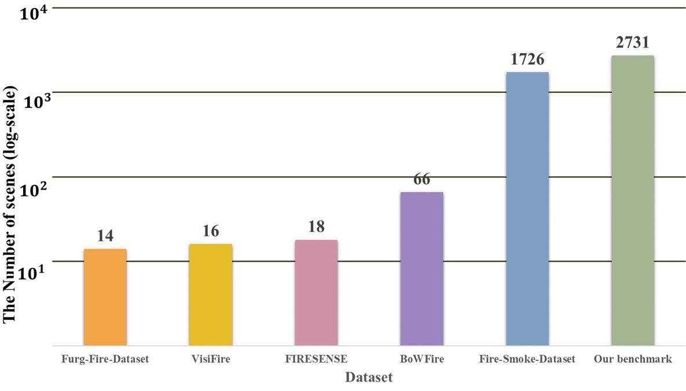
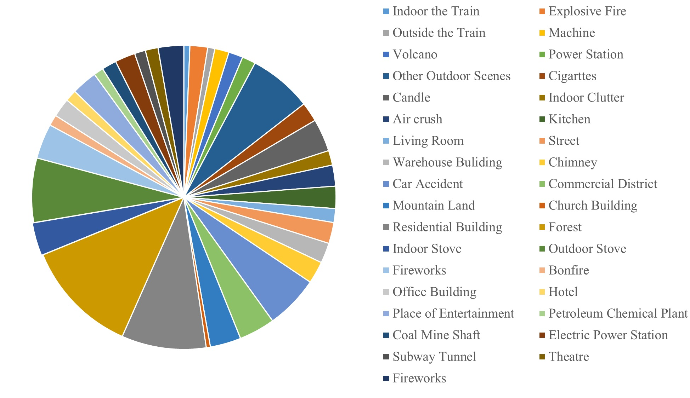

<h1 align="center"><strong>Benchmarking Multi-Scene Fire and Smoke Detection</strong></h1>

<p align="center">
  
  
 <p align="center">
  <a href="https://link.springer.com/chapter/10.1007/978-981-97-8795-1_14" target='_blank'>
    
  </a>
  &nbsp;&nbsp;&nbsp;
  <a href="https://arxiv.org/abs/2410.16631" target='_blank'>
    
  </a>
  &nbsp;&nbsp;&nbsp;
  <a href="https://xiaoyihan6.github.io/FSD/" target='_blank'>
    
  </a>
  &nbsp;&nbsp;&nbsp;
  <a href="https://drive.google.com/drive/folders/1zMthhy524r1v7nMzLzb12qcvzz9F440a?usp=drive_link" target='_blank'>
    
  </a>
  &nbsp;&nbsp;&nbsp;
  <a href="https://drive.google.com/file/d/14ylxaNBVmXjAFXt2h4lnyBe7xELhOVHc/view?usp=drive_link" target='_blank'>
    
  </a>
  &nbsp;&nbsp;&nbsp;
  <a href="https://github.com/XiaoyiHan6/MS-FSDB" target='_blank'>
    
  </a> 
 </p>

 <p align="center">
  <font size=5><strong>Benchmarking Multi-Scene Fire and Smoke Detection</strong></font>
    <br>
        <a href="https://xiaoyihan6.github.io/">Xiaoyi Han</a>,
        <a href="https://tpcd.github.io/">Nan Pu</a>,
        <a href="https://person.zju.edu.cn/fengzunlei">Zunlei Feng</a>,<br>
        <a href="https://person.zju.edu.cn/beiyj">Yijun Bei</a>,
        <a href="https://person.zju.edu.cn/zhangqf">Qifei Zhang</a>,
        <a href="https://faculty.hfut.edu.cn/ChengLechao/zh_CN/index.htm">Lechao Cheng</a>,
        <a href="https://csaic.szcu.edu.cn/2023/0721/c3057a54298/page.htm">Liang Xue</a>,<br>
    <br>
  Zhejiang University & University of Trento & Hefei University of Technology & Suzhou City University
  <br>
  Accepted to PRCV 2024
  </p>
</p>

---
<h2 align="center">
<strong>Note</strong>
</h2>

Dear Visitors,
<br>
Hello! If you would like to use our Unified FSD Datasets, please click on the Google Drive link and <strong>provide</strong> your <strong>institution</strong> (e.g., school, company, or None if applicable) along with a brief description of your intended use for the datasets. After that, please send a request for access to the shared folder. <strong>Note</strong>: Applications without an institution and a description of the intended use will be <strong>rejected</strong>.
<br>
&nbsp;&nbsp;Additionally, our code includes data processing and evaluation methods. You can view it on our <a href="https://github.com/XiaoyiHan6/MS-FSDB" target="_blank"><font color="0000FF">GitHub</font></a>. Thank you!
<br>
Best regards,
<br>
Xiaoyi Han

---

<h2 align="center">
<strong>Our MS-FSDB and other FSD Datasets Overview</strong>
</h2>

<h3 align="center">
<strong>Multi-Scene Fire and Smoke Detection Benchmark (MS-FSDB)</strong>
</h3>


At first, we propose a new Multi-Scene Fire and Smoke Detection Benchmark (MS-FSDB) comprising 12,586 images, depicting 2,731 scenes as illustrated in the aforementioned images. Most images within our benchmark possess dimensions exceeding 600 pixels in either length or width. Unlike previous public Fire and Smoke Detection (FSD) datasets, our benchmark not only includes flame detection but also smoke detection tasks. Additionally, it captures complex scenes featuring occlusion, multiple targets, and various viewpoints.
<br>
<br>
To access our MS-FSDB, please click [here](https://drive.google.com/file/d/14ylxaNBVmXjAFXt2h4lnyBe7xELhOVHc/view?usp=drive_link).


<h3 align="center">
<strong>The Five public FSD datasets</strong>
</h3> 
To access the five public FSD datasets, please click [here](https://drive.google.com/drive/folders/1zMthhy524r1v7nMzLzb12qcvzz9F440a?usp=drive_link).

And, these FSD datasets, include:

:one: :fire: Fire-Smoke-Dataset, please click [here](https://drive.google.com/file/d/1btlhi64GyOLIaF0BT3EvTU3Xvn8SuQ88/view?usp=drive_link).

:pencil2: DeepQuestAI, Fire-smoke-dataset (2021). URL https://github.com/DeepQuestAI/Fire-Smoke-Dataset

:two: :fire: Furg-Fire-Dataset, please click [here](https://drive.google.com/file/d/1MzenvTqhgdR2FgMx2r3tWmDHTh0XcvpK/view?usp=drive_link). 

:pencil2: V. H¨uttner, C. R. Steffens, S. S. da Costa Botelho, First response fire combat: Deep
leaning based visible fire detection, in: 2017 Latin American Robotics Symposium
(LARS) and 2017 Brazilian Symposium on Robotics (SBR), IEEE, 2017, pp. 1–6.
[doi:10.1109/SBR-LARS-R.2017.8215312](https://sci-hub.st/10.1109/sbr-lars-r.2017.8215312).


:three: :fire: VisiFire, please click [here](https://drive.google.com/file/d/13LdhM7LerDX9Ia5QokY1gMPE2hU-2GV6/view?usp=drive_link).

:pencil2: B. U. Toreyin, A. E. Cetin, Online detection of fire in video, in: 2007 IEEE
Conference on Computer Vision and Pattern Recognition, 2007, pp. 1–5. [doi:
10.1109/CVPR.2007.383442](https://sci-hub.se/10.1109/cvpr.2007.383442)

:four: :fire: FIRESENSE, please click [here](https://drive.google.com/file/d/1SOCa1Xju0Qf8-uOYfHK9nT8JZi4Che5b/view?usp=drive_link).

:pencil2: K. Dimitropoulos, P. Barmpoutis, N. Grammalidis, Spatio-temporal flame model-
ing and dynamic texture analysis for automatic video-based fire detection, IEEE
Transactions on Circuits and Systems for Video Technology 25 (2) (2015) 339–351.
[doi:10.1109/TCSVT.2014.2339592](https://sci-hub.st/10.1109/tcsvt.2014.2339592).


:five: :fire: BowFire, please click [here](https://drive.google.com/file/d/1a1pND0gVut2Jty0L2uJd8g8jBUM_x6-l/view?usp=drive_link).

:pencil2: D. Y. T. Chino, L. P. S. Avalhais, J. F. Rodrigues, A. J. M. Traina, Bowfire:
Detection of fire in still images by integrating pixel color and texture analysis, in:
2015 28th SIBGRAPI Conference on Graphics, Patterns and Images, 2015, pp.
95–102. [doi:10.1109/SIBGRAPI.2015.19](https://arxiv.org/abs/1506.03495).


---

<h2 align="center">
<strong>The directory structure of all these FSD Datasets and our data code</strong>
</h2>

<h3 align="center">
<strong>The directory structure of all these FSD Datasets</strong>
</h3>

The directory structure of all these FSD Datasets follows the layout below:(1.VisiFire, 2.FIRESENSE, 3.Furg-Fire-Dataset, 4.BowFire, 5.Fire-Smoke-Dataset, 6.MS-FSDB)

```
FSD Dataset
|
|--data--|--predefined_classes.txt (Fire and Smoke)
|
|--images--|--000001.jpg
|
|--labels--|--000001.xml
|
|--layout--|--train.txt
|          |--test.txt
|          |--minitrain.txt
|          |--minitest.txt
|          |...
```

<h3 align="center">
<strong>The directory structure of data code<strong>
</h3>

our directory structure gitHub MS-FSDB follows the layout below:
(In this piece of code, "FireDataset", "myfire", and "minimyfire" all represent our MS-FSD benchmark.)

```
MS-FSDB
|
|--data--|--fire.py (data processing)
|        |--option--|--eval.py(data pre-use)
|        |--tools--|--eval_voc.py(data eval)
|        
|--assets--|--logo_benchmark_FSD.png
|
|--LICENSE
|
|--README.md
```

---

<h2 align="center">
<strong>Results and Benchmark Presentation</strong>
</h2>

<h3 align="center">
<strong>Quantitative Results</strong>
</h3>

Table 1: Baseline models comparison across different datasets, where Fire represents the Average Precision (%) of fire, Smoke represents the Average Precision (%) of smoke, and "mAP" represents the mean Average Precision (%) of fire and smoke. “s" represents the input image of small size, while “l" represents the input image of large size, and the specific content is in the subsection “Basic Experiments". F-RCNN means Faster RCNN. Ours means our method.

| Dataset                   | Model         | Fire  | Smoke | mAP   | Fire  | Smoke | mAP   | Fire  | Smoke | mAP   | Fire  | Smoke | mAP   | Fire  | Smoke | mAP   |
|---------------------------|---------------|-------|-------|-------|-------|-------|-------|-------|-------|-------|-------|-------|-------|-------|-------|-------|
|                           |               | **SSD** (s/l) |       |       | **RetinaNet** (s/l) |       |       | **F-RCNN** (s/l) |       |       | **FCOS** (s/l) |       |       | **Ours** (s/l) |       |       |
| Fire-Smoke-Dataset (s) |               | 77.5  | 90.8  | 84.1  | 90.7  | 90.7  | 90.7  | 97.3  | 93.2  | 95.3  | 97.2  | 98.5  | 97.8  | **97.5** | **99.2** | **98.3** |
| Furg-Fire-Dataset (s)  |               | 75.8  | 86.9  | 81.4  | 81.7  | 90.0  | 85.8  | **95.8** | 93.4  | 94.6  | 93.7  | **98.1** | 95.9  | 94.2  | **98.1** | **96.1** |
| VisiFire (s)           |               | 78.2  | 89.5  | 83.9  | 84.2  | 90.7  | 87.4  | 92.8  | 88.8  | 90.8  | 88.8  | 96.7  | 92.8  | **96.2** | **99.4** | **97.8** |
| FIRESENSE (s)          |               | 89.0  | 90.4  | 89.7  | 90.9  | 90.9  | 90.9  | 96.8  | 95.8  | 96.3  | 96.1  | 96.1  | 96.1  | **98.3** | **98.1** | **98.2** |
| BoWFireDataset (s)     |               | 69.6  | 84.7  | 77.1  | 72.3  | 88.4  | 80.3  | **86.3** | 95.0  | 90.6  | 85.1  | 95.2  | 90.2  | 86.1  | **97.9** | **92.0** |
| miniMS-FSDB (s)        |               | 71.2  | 84.4  | 77.8  | 80.4  | 89.4  | 84.9  | 98.0  | 93.0  | 95.5  | 94.1  | 95.9  | 95.0  | **98.3** | **99.3** | **98.8** |
| MF-FSDB (s)            |               | 81.0  | 90.2  | 85.6  | 81.0  | 90.5  | 85.8  | **98.2** | 93.5  | 95.8  | 95.6  | 98.4  | 97.0  | 97.1  | **98.9** | **98.0** |
| miniMS-FSDB (l)        |               | 75.9  | 87.1  | 81.5  | 87.0  | 88.4  | 87.7  | 98.0  | 94.1  | 96.1  | 95.5  | 96.2  | 95.8  | **98.1** | **97.6** | **97.9** |
| MS-FSDB (l)            |               | 88.0  | 90.9  | 89.4  | 89.5  | 89.6  | 89.6  | 97.3  | 95.9  | 96.6  | 96.0  | 96.7  | 96.3  | **98.4** | **98.6** | **98.5** |

---

<h3 align="center">
<strong>Benchmark Presentation</strong>
</h3>

There is Illustrations of several Fire and Smoke Detection (FSD) datasets statistics. (a) represents the statistics comparison of several FSD datasets scenes. (b) provides more detailed statistics for our benchmark. In (b), the area of the sector corresponds to the number of scenes. Additionally, the total number of scenes equals 2731, as displayed in (a).

<div style="display: flex; justify-content: space-between;">
  <div style="width: 20%;">
    <h4>(a)</h4>
    
  </div>
  <div style="width: 20%;">
    <h4>(b)</h4>
    
  </div>
</div>
  
---

<h2 align="center">
<strong>BibTeX</strong>
</h2>
 
```
@InProceedings{han2025prcv,
      author="Han, Xiaoyi and Pu, Nan and Feng, Zunlei and Bei, Yijun and Zhang, Qifei and Cheng, Lechao and Xue, Liang", 
      editor="Lin, Zhouchen and Cheng, Ming-Ming and He, Ran and Ubul, Kurban and Silamu, Wushouer and Zha, Hongbin and Zhou, Jie and Liu, Cheng-Lin", 
      title="Benchmarking Multi-Scene Fire and Smoke Detection",booktitle="Pattern Recognition and Computer Vision", 
      year="2025", publisher="Springer Nature Singapore", address="Singapore", pages="203--218", 
      abstract="The current irregularities in existing public Fire and Smoke Detection (FSD) datasets have become a bottleneck in the advancement of FSD technology. Upon in-depth analysis, we identify the core issue as the lack of standardized dataset construction, uniform evaluation systems, and clear performance benchmarks. To address this issue and drive innovation in FSD technology, we systematically gather diverse resources from public sources to create a more comprehensive and refined FSD benchmark. Additionally, recognizing the inadequate coverage of existing dataset scenes, we strategically expand scenes, relabel, and standardize existing public FSD datasets to ensure accuracy and consistency. We aim to establish a standardized, realistic, unified, and efficient FSD research platform that mirrors real-life scenes closely. Through our efforts, we aim to provide robust support for the breakthrough and development of FSD technology. The project is available at https://xiaoyihan6.github.io/FSD/.",
isbn="978-981-97-8795-1"}
```
---
**Note**: Could you please give me a "one-click triple support"🔥 ("**Star**"🚀,"**Fork**"🔖,"**Issues**"❓)<br>
