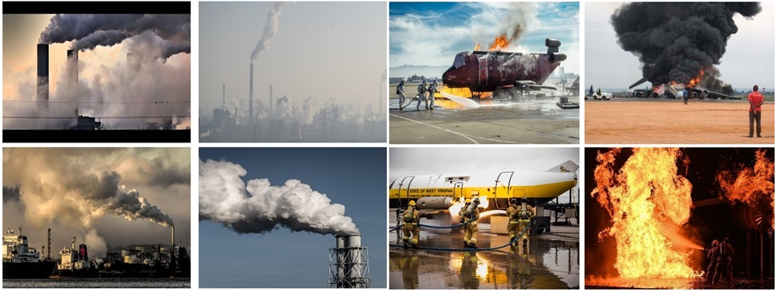

# Benchmarking Multi-Scene Fire and Smoke Detection

<p align="center">
  
  
 <p align="center">
  <a href="https://link.springer.com/chapter/10.1007/978-981-97-8795-1_14" target='_blank'>
    
  </a>
  &nbsp;&nbsp;&nbsp;
  <a href="https://arxiv.org/abs/2410.16631" target='_blank'>
    
  </a>
  &nbsp;&nbsp;&nbsp;
  <a href="https://xiaoyihan6.github.io/FSD/" target='_blank'>
    
  </a>
  &nbsp;&nbsp;&nbsp;
  <a href="" target='_blank'>
    
  </a>
  &nbsp;&nbsp;&nbsp;
  <a href="" target='_blank'>
    
  </a>
  &nbsp;&nbsp;&nbsp;
  <a href="https://github.com/XiaoyiHan6/MS-FSDB" target='_blank'>
    
 </p>
  </a>
<p align="center">
  <font size=5><strong>Benchmarking Multi-Scene Fire and Smoke Detection</strong></font>
    <br>
        <a href="https://xiaoyihan6.github.io/">Xiaoyi Han</a>,
        <a href="https://tpcd.github.io/">Nan Pu</a>,
        <a href="https://person.zju.edu.cn/fengzunlei">Zunlei Feng</a>,<br>
        <a href="https://person.zju.edu.cn/beiyj">Yijun Bei</a>,
        <a href="https://person.zju.edu.cn/zhangqf">Qifei Zhang</a>,
        <a href="https://faculty.hfut.edu.cn/ChengLechao/zh_CN/index.htm">Lechao Cheng</a>,
        <a href="https://csaic.szcu.edu.cn/2023/0721/c3057a54298/page.htm">Liang Xue</a>,<br>
    <br>
  Zhejiang University & University of Trento & Hefei University of Technology & Suzhou City University
  <br>
  Accepted to PRCV 2025
  </p>
</p>

---
<p align="center">
Note
</p>
<br>
Hello everyone, 
We're facing a challenge with our six Fire and Smoke Detection (FSD) Datasets which are quite substantial in size. Could you kindly **suggest** any **free cloud storage** services based **outside of China** where we can store these files?

Additionally, we plan to distribute the code used for assessing these datasets. Now we just distribute the code for processing. Your recommendations would be greatly appreciated!

---
We will provide five public Fire and Smoke Detection (FSD) datasets along with our own MS-FSDB.
The Five public FSD datasets include:

:one: :fire: VisiFire

:pencil2: B. U. Toreyin, A. E. Cetin, Online detection of fire in video, in: 2007 IEEE
Conference on Computer Vision and Pattern Recognition, 2007, pp. 1–5. [doi:
10.1109/CVPR.2007.383442](https://sci-hub.se/10.1109/cvpr.2007.383442)

:two: :fire: FIRESENSE

:pencil2: K. Dimitropoulos, P. Barmpoutis, N. Grammalidis, Spatio-temporal flame model-
ing and dynamic texture analysis for automatic video-based fire detection, IEEE
Transactions on Circuits and Systems for Video Technology 25 (2) (2015) 339–351.
[doi:10.1109/TCSVT.2014.2339592](https://sci-hub.st/10.1109/tcsvt.2014.2339592).

:three: :fire: Furg-Fire-Dataset 

:pencil2: V. H¨uttner, C. R. Steffens, S. S. da Costa Botelho, First response fire combat: Deep
leaning based visible fire detection, in: 2017 Latin American Robotics Symposium
(LARS) and 2017 Brazilian Symposium on Robotics (SBR), IEEE, 2017, pp. 1–6.
[doi:10.1109/SBR-LARS-R.2017.8215312](https://sci-hub.st/10.1109/sbr-lars-r.2017.8215312).


:four: :fire: BowFire

:pencil2: D. Y. T. Chino, L. P. S. Avalhais, J. F. Rodrigues, A. J. M. Traina, Bowfire:
Detection of fire in still images by integrating pixel color and texture analysis, in:
2015 28th SIBGRAPI Conference on Graphics, Patterns and Images, 2015, pp.
95–102. [doi:10.1109/SIBGRAPI.2015.19](https://arxiv.org/abs/1506.03495).

:five: :fire: Fire-Smoke-Dataset

:pencil2: DeepQuestAI, Fire-smoke-dataset (2021). URL https://github.com/DeepQuestAI/Fire-Smoke-Dataset

---

The directory structure of all these FSD Datasets follows the layout below:(1.VisiFire, 2.FIRESENSE, 3.Furg-Fire-Dataset, 4.BowFire, 5.Fire-Smoke-Dataset, 6.MS-FSDB)

```
FSD Dataset
|
|--data--|--predefined_classes.txt (Fire and Smoke)
|
|--images--|--000001.jpg
|
|--labels--|--000001.xml
|
|--layout--|--train.txt
|          |--test.txt
|          |--minitrain.txt
|          |--minitest.txt
|          |...
```   
---

**Note**: Could you please give me a "one-click triple support"🔥 ("**Star**"🚀,"**Fork**"🔖,"**Issues**"❓)<br>
